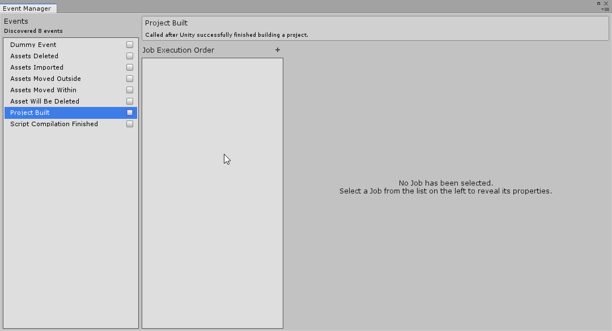
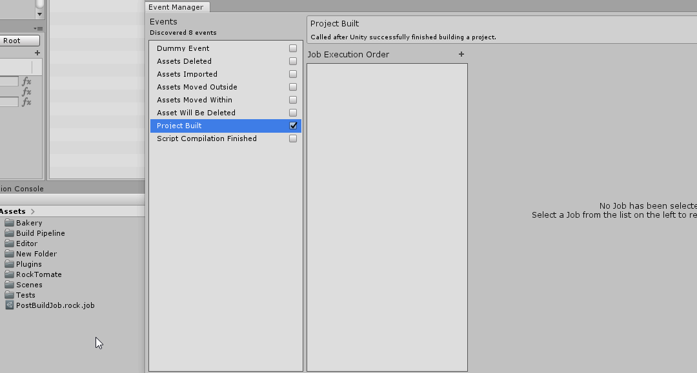
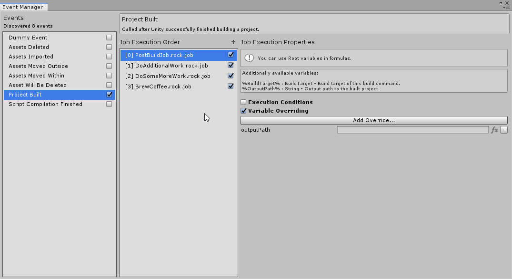

## Accessing Event Manager

Event Manager window can be opened by going to `Tools/RockTomate/Windows/Event Manager`.

## Subscribing to an Event

Event Manager window is split into 3 main columns: Events, Job Execution Order and Properties.

To subscribe to an event, simply check one of the events listed in the 1st column.

## Adding a Job

To dictate which jobs to run when given event is triggered, add a job file by pressing the `+` icon at the top or drag a job asset into the 2nd column.

And we're done! Now, whenever a subscribed event is triggered (in this example, after Unity successfully finishes building a project) a job will be executed.

But what if we took this further?

## Job Execution Order

Adding multiple Jobs would have them run one-by-one from top to bottom. Order of execution can be changed.

