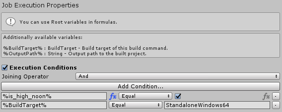
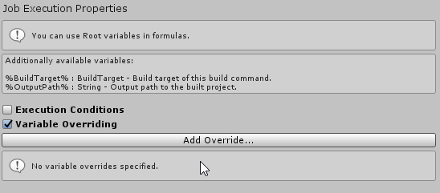

Event Manager allows further configuration of executing jobs. Job Execution Properties are configured per execution job, allowing for a finer control over executing jobs.

## Conditional Execution

You can control when Job should run and when it shouldn't by specifying Execution Conditions.

> While you can reference Root variables and event variables in formulas, you cannot reference Job variables.

With "Execution Conditions" option enabled, this Job will be executed only if this the result condition returns "True".

## Variable Overriding

Some events supported by the Event Manager also pass parameters. For example, "Project Built" event has "Build Target" and "Output Path". 

You have access to those parameters via, which ultimately can be used to override job variables, or create entirely new ones.

By pressing "Add Override..." you have an option to either include an existing Job variable or create a new one. 

> You cannot override variables from a referenced Variable Bank, but you can create a variable with the same name as of one from a Variable Bank, which can override that instead.