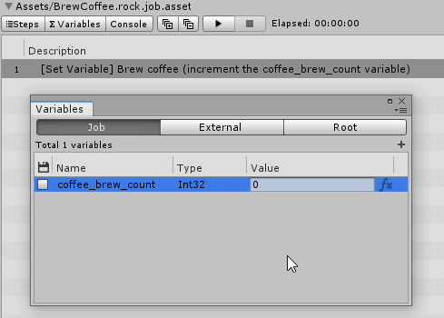
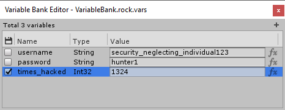

During job execution, variable values can be modified. However, by default, variable values never survive the end of job execution, resetting the value to as it was before job has been executed. This ensures that jobs will not interfere with itself down the line and makes executions predicable.

Since version 1.1.0, you can now specify if you want variable values persist between job executions.

> Variables evaluated with formulas cannot be persistent.

## Flagging variable as "Persistent"

In Variable Manager Window, you will be greeted with a new column with a floppy disc icon.

Setting it to true will ensure that variable value evaluated during job execution will persist.

## Variable Banks

Variables defined in Variable Banks can also be marked as persistent.

